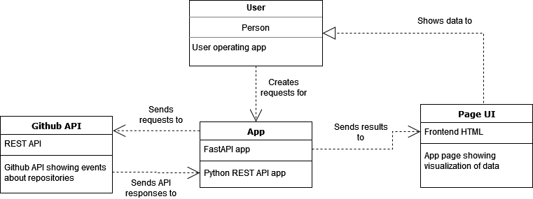

# Datamole REST API assignment

## Prepare environment
- With Python 3.11 run `pip install -r requirement.txt`
## Run app
- Run command `python -m uvicorn main:app --reload` in root dir of project

### Project properties & assumptions
- There is theoretical limit on number of events this app can handle
  - It was tested with higher tens of 'interested events' without any issue
- Visualisation of interested events in home page is "as-is"
  - As there wasn't enough data to properly test it
- C4 model

### Created by:
### Jan Krumpholc